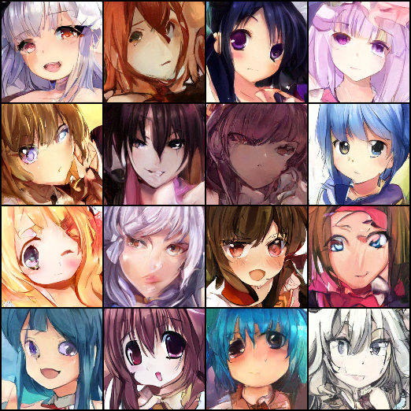

# TorchDiffusion
One Diffusion model implementation base on LibTorch, The LibTorch version is almost transfer from my pytorch implementation
[https://github.com/GlassyWing/sampler](https://github.com/GlassyWing/sampler)

## Install

on linux

```
mkdir build
cd build
cmake  -DCMAKE_PREFIX_PATH="/path/to/libtorch;/path/to/opencv" ..
```

on windows (assume the Visual Studio 2019/2022 has installed)
```
mkdir build
cd build
cmd /C "C:\Program Files\Microsoft Visual Studio\2022\Community\Common7\IDE\CommonExtensions\Microsoft\CMake\CMake\bin\cmake"  -DCMAKE_PREFIX_PATH="/path/to/libtorch;/path/to/opencv" ..
```

The project will created under the directory `build`.

## Build

Using the command to create one Release version.

```
cd build
cmake --build . --config Release
```

The runnable program will be build, the location depends on your OS, with windows, it's `build/Release/diffusion.exe`.

## Usage

### Train

```
./diffusion --dataset <dataset_dir> -t ddim -s 4
```

The default will create one `experiments` folder used to save the checkpoints and log images.

see more with `./diffusion -h`

### Inference

To generate one 4x4 demo image by this way:

```
./diffusion --mode test --weight_path <path/to/weight_path> -t ddim -s 8
```

## Generate Example

Several epochs training (140k images):



## QA

1. How long does it take to train to see considerable results?

    About 30min on 3090.

2. Memory usage?

    Image Size: 128 x 128

    Batch Size: 32

    Memory: 3GB

    Vedio Memroy: 13GB

3. Performance compare to pytorch?

    About 10-15% speedups.